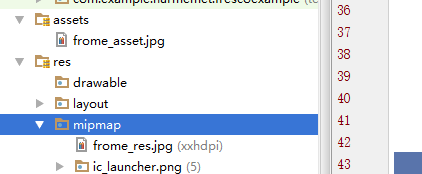

# FrescoUtils
Fresco的基本使用
检查缓存
```java
 String imgAddress = "http://img.pconline.com.cn/images/upload/upc/tx/itbbs/1608/08/c29/25288629_1470644246858_mthumb.jpg";
 boolean isCacheInDisk = Fresco.getImagePipelineFactory().getMainFileCache().hasKey(new SimpleCacheKey(imgAddress));
```

缓存一张图片(只是缓存不显示)
```java
 ImageRequest request = ImageRequestBuilder
                    .newBuilderWithSource(Uri.parse(imgAddress)).build();
 Fresco.getImagePipelineFactory().getImagePipeline().prefetchToDiskCache(request, null);
```

显示res,assets,local图片
```java
fromeAsset = (SimpleDraweeView) findViewById(R.id.frome_asset);
fromeAsset.setImageURI(Uri.parse("asset:///frome_asset.jpg"));//注意是asset
fromeLocal = (SimpleDraweeView) findViewById(R.id.frome_local);
fromeLocal.setImageURI(Uri.parse("file:///" + Environment.getExternalStorageDirectory().getAbsolutePath() + "/aatest/frome_local.jpg"));
//我是手机里新建个文件夹叫aatest里面放了张图片叫frome_local.jpg
fromeRes = (SimpleDraweeView) findViewById(R.id.frome_res);
fromeRes.setImageURI(Uri.parse("res:///" + R.mipmap.frome_res));

```




Fresco使用okhttp
```java
//图片加载速度会快很多的
OkHttpClient.Builder builder = new OkHttpClient.Builder();
builder.connectTimeout(15000, TimeUnit.MILLISECONDS);
OkHttpClient client=builder.build();
ImagePipelineConfig config = OkHttpImagePipelineConfigFactory
                .newBuilder(getApplicationContext(), client)
                .build();
        Fresco.initialize(this, config);

//  compile 'com.facebook.fresco:imagepipeline-okhttp3:0.12.0+'

```

显示gif
```java
//gif显示
//要添加这个库 compile 'com.facebook.fresco:animated-gif:0.12.0'
String gifAddress = "http://images.missyuan.com/attachments/day_110808/20110808_9fb3173c11a2f20005ee71TDj0m1C1nm.gif";
DraweeController gifController = Fresco.newDraweeControllerBuilder().setUri(gifAddress).setAutoPlayAnimations(true).build();
gifImg.setController(gifController);

```

先加载低分辨率图片，在加载高分辨率图片
```java
String lowResUri = "http://img4.imgtn.bdimg.com/it/u=885232197,1834744423&fm=21&gp=0.jpg";
String highResUri = "http://img.pconline.com.cn/images/upload/upc/tx/wallpaper/1212/06/c1/16396010_1354784049718.jpg";
DraweeController ctl = Fresco.newDraweeControllerBuilder()
                .setLowResImageRequest(ImageRequest.fromUri(lowResUri))
                .setImageRequest(ImageRequest.fromUri(highResUri))
                .setOldController(img.getController())
                .build();
img.setController(ctl);
```

清理缓存
```java

ImagePipeline imagePipeline = Fresco.getImagePipeline();
Uri uri = Uri.parse(imgAddress);

// 从内存中删除
imagePipeline.evictFromMemoryCache(uri);
// 从磁盘中删除
imagePipeline.evictFromDiskCache(uri);
// 同时从文件和磁盘中删除当前uri的缓存
imagePipeline.evictFromCache(uri);

imagePipeline.clearMemoryCaches();
imagePipeline.clearDiskCaches();
// 同时清除内存和磁盘缓存
imagePipeline.clearCaches();
```

代码设置属性
```java
test = (SimpleDraweeView) findViewById(R.id.hiechery_test);
test.setImageURI(imgAddress);
GenericDraweeHierarchy hierarchy = test.getHierarchy();
RoundingParams roundingParams = new RoundingParams();
// 设置边框颜色和宽度
roundingParams.setBorder(Color.RED, 10.0f);
// 设置圆角半径
roundingParams.setCornersRadius(20.0f);
hierarchy.setRoundingParams(roundingParams);
roundingParams.setRoundAsCircle(true);

//drawee支持如下属性,并且以下属性都可以用GenericDraweeHierarchy代码控制
//fresco:fadeDuration="300" // 淡入淡出的持续时间
// fresco:actualImageScaleType="focusCrop"  // 实际图像的缩放类型
//fresco:placeholderImage="@color/wait_color"  //占位图
// fresco:placeholderImageScaleType="fitCenter" //占位图的缩放类型
// fresco:failureImage="@drawable/error" //下载失败显示的图片
//fresco:failureImageScaleType="centerInside" //失败图的缩放类型
// fresco:retryImage="@drawable/retrying"
//图片加载失败时显示，提示用户点击重新加载，重复加载4次还是没有加载出来的时候才会显示failureImage的图片
//fresco:retryImageScaleType="centerCrop" //重新加载的图片缩放类型
// fresco:progressBarImage="@drawable/progress_bar" //进度条图片
// fresco:progressBarImageScaleType="centerInside"
// fresco:progressBarAutoRotateInterval="1000"
//进度图自动旋转间隔时间(单位：毫秒ms)
// fresco:backgroundImage="@color/blue"
//背景图片，这里的背景图片首先被绘制
//fresco:overlayImage="@drawable/watermark"
// 设置叠加图，在xml中只能设置一张叠加图片，如果需要多张图片的话，需要在java代码中设置哦
// fresco:pressedStateOverlayImage="@color/red"
// 设置点击状态下的叠加图
// fresco:roundAsCircle="false" //设置为圆形图
// fresco:roundedCornerRadius="1dp" // 圆角半径
//  fresco:roundTopLeft="true" // 左上角是否为圆角
// fresco:roundTopRight="false"
// fresco:roundBottomLeft="false"
// fresco:roundBottomRight="true"
//fresco:roundWithOverlayColor="@color/corner_color"
// fresco:roundingBorderWidth="2dp" //边框的宽度
// fresco:roundingBorderColor="@color/border_color" //边框颜色
```


 根据尺寸，url下载图片
```java

                ImageRequestBuilder builder = ImageRequestBuilder.newBuilderWithSource(Uri.parse(uri));
                if (width > 0 && height > 0) {
                    builder.setResizeOptions(new ResizeOptions(width, height));
                }
                ImageRequest imageRequest = builder.build();

                ImagePipeline imagePipeline = Fresco.getImagePipeline();
                DataSource<CloseableReference<CloseableImage>> dataSource = imagePipeline.fetchDecodedImage(imageRequest, context);

                dataSource.subscribe(new BaseBitmapDataSubscriber() {
                                         @Override
                                         public void onNewResultImpl(@Nullable Bitmap bitmap) {
                                            
                                         }

                                         @Override
                                         public void onFailureImpl(DataSource dataSource) {
                                             
                                         }
                                     },
                        UiThreadImmediateExecutorService.getInstance());

```

 获取缓存图片地址
```java

  public void getChachedAddr(View view) {
        ImageRequest request = ImageRequest.fromUri(url);
        CacheKey cacheKey = DefaultCacheKeyFactory.getInstance().getEncodedCacheKey(request, null);
        boolean hasCached = ImagePipelineFactory.getInstance().getMainFileCache().hasKey(cacheKey);
        if (hasCached) {
            BinaryResource binaryResource = ImagePipelineFactory.getInstance().getMainFileCache().getResource(cacheKey);
            File file = ((FileBinaryResource) binaryResource).getFile();
            if (file != null) {
                mChacheAddr.setText(file.getAbsolutePath());
            }
        }
    }

```
